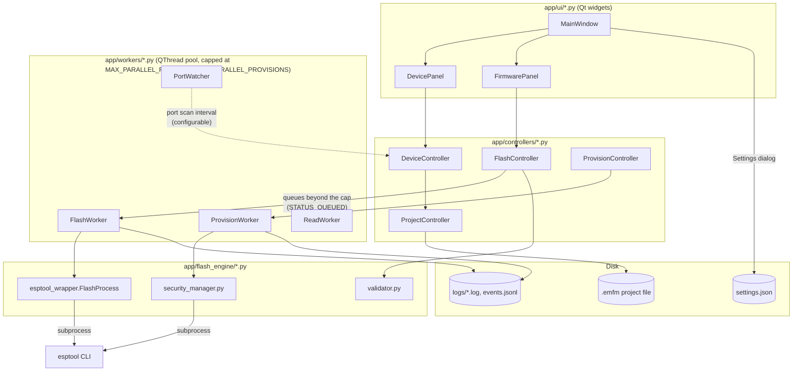

# Developer Documentation — ESP32 Multi Flash Manager

This document is for engineers extending or maintaining the codebase.

## 1. Design principles

1. **Strict MVC.** `app/models` contains plain dataclasses with zero Qt
   imports — they're trivially unit-testable and JSON-serializable.
   `app/controllers` are `QObject`s that own no widgets, only emit Qt
   `Signal`s and expose plain methods. `app/ui` widgets only ever call
   controller methods and connect to controller signals — they never call
   into `flash_engine`, `project_manager`, `firmware_manager`, or
   `device_manager` directly.
2. **Out-of-process flashing.** `esptool` is invoked as a subprocess
   (`python -m esptool ...`), never imported and called in-process. This
   isolates the GUI from esptool's `sys.exit()` calls and `\r`-based
   progress printing, and lets us kill a stuck flash cleanly. See
   `app/flash_engine/esptool_wrapper.py`. `FlashProcess` drains the
   subprocess's stdout on its own background thread into a queue rather
   than iterating it directly from the QThread, so `FlashWorker` can poll
   with a timeout (`FLASH_STALL_TIMEOUT_SECONDS`, 45s by default and
   user-configurable via `Settings → General → Flash Stall Timeout`,
   resolved once on the main thread at worker-construction time — see
   `app.utilities.app_settings.get_flash_stall_timeout_seconds` — rather
   than read from inside the worker thread itself, since this app's
   settings loader touches `os.environ` on first use and doing that from
   a background `QThread` can race with the main thread) instead
   of blocking forever — a device that disconnects mid-write can leave
   the OS serial driver parked in an uninterruptible I/O wait that
   esptool has no timeout for, and without this the worker's QThread
   (and therefore `FlashController.is_busy()`) never returns.
3. **One QThread per device, up to a configurable cap, during a batch.**
   `FlashWorker` (in `app/workers/flash_worker.py`) is a `QThread`
   subclass; of the `N` devices selected for upload, up to
   `get_max_parallel_flashes()` (Settings → General → "Max Parallel
   Flashes", default `MAX_PARALLEL_FLASHES` = 8) run as concurrent
   `FlashWorker` instances at once, each with its own subprocess. Any
   remainder sits in `FlashController._queue` (status `STATUS_QUEUED`)
   and is launched one-for-one as running workers finish, so a batch of
   dozens of devices can't exhaust OS threads, file descriptors, or USB
   bandwidth by firing every subprocess simultaneously.
   `FlashController` aggregates `finished_flash` signals (plus queued
   devices resolved via cancellation) to know when the whole batch is
   done. `ProvisionWorker`/`ProvisionController` (see §"Provisioning
   flow" below) apply the identical pattern to batch eFuse burning, with
   its own settings-backed cap (`get_max_parallel_provisions()`) and
   stall timeout (`get_provision_stall_timeout_seconds()`), both resolved
   the same way -- once, on the main thread, at worker-construction time.
   `finished_flash`/`finished_provision` is emitted from inside `run()`
   a few instructions before the `QThread`'s OS thread actually exits, so
   both controllers' `_on_worker_finished` call `worker.wait()` (bounded
   to 5s, logged rather than raised on timeout) before doing anything
   else once that signal arrives -- otherwise nothing keeps the worker
   alive past that point, and a still-finishing `QThread` can be raced by
   whatever runs next, the same `os.environ` hazard described in point 2
   above from the "leftover thread" angle instead of the "read during
   `run()`" angle.
4. **Never crash.** `app/main.py` installs a global `sys.excepthook` that
   logs any unhandled exception to `error.log` and shows a message box,
   instead of letting Qt/Python kill the process silently. Additionally,
   `FlashWorker.run()` wraps its entire body in a broad `except Exception`
   so a single device's failure can never propagate and kill other
   in-flight workers or the UI thread.
5. **Everything persists through plain JSON**, not pickle — `.emfm`
   project files and firmware profile files are both readable/diffable/
   editable by hand if needed, which matters a lot in a manufacturing
   environment where configs get checked into version control or emailed
   around.

## 2. Module map

| Module | Responsibility |
|---|---|
| `app/models/device_model.py` | `DeviceConfig` (persisted config) + `DeviceRuntimeState` (transient progress/status, not persisted) |
| `app/models/firmware_model.py` | `FirmwareEntry`: one `.bin` + address + computed MD5/size/missing-flag |
| `app/models/project_model.py` | `ProjectModel`: the full save-file contents |
| `app/models/history_model.py` | `HistoryEntry` (now with `id`/`device_id`/`mac_address`/`qc_status`) + CSV export helper |
| `app/controllers/device_controller.py` | CRUD + search + batch-edit over the device list |
| `app/controllers/undo_stack.py` | `UndoStack`/`UndoEntry`: bounded, whole-device-list-snapshot undo/redo backing `DeviceController`'s four bulk mutation operations |
| `app/controllers/flash_controller.py` | Spins up/tracks `FlashWorker`s, aggregates batch completion, emits history entries |
| `app/controllers/provision_controller.py` | Batch counterpart of `flash_controller.py`: spins up/tracks `ProvisionWorker`s across multiple devices at once, same parallel-cap/queue design |
| `app/controllers/project_controller.py` | New/open/save/save-as, missing-firmware detection on load |
| `app/flash_engine/esptool_wrapper.py` | `FlashCommandBuilder` (DeviceConfig → argv) + `FlashProcess` (subprocess wrapper) + `parse_progress_line` |
| `app/flash_engine/validator.py` | Pure, offline pre-upload validation (duplicate/invalid/overlapping addresses, port availability, etc.) → `ValidationReport` |
| `app/project_manager/project_io.py` | `.emfm`/`.efmproj` project I/O: atomic (temp-file + `os.replace`) save/load, `schema_version` migration on load and re-stamping on every save, advisory cross-process/cross-machine locking (hidden sidecar), firmware-path relativization, crash-recovery autosave slot, and the recent-projects list (via `app_settings.py`) |
| `app/project_manager/csv_import.py` | CSV → `list[DeviceConfig]` device import, skip-bad-row-not-whole-file error model |
| `app/project_manager/zip_manifest_import.py` | `.zip` (firmware binaries + manifest CSV) → `list[DeviceConfig]` with firmware pre-assigned; zip-slip-safe extraction, size/row caps |
| `app/device_manager/port_scanner.py` | pyserial wrapper: `list_available_ports()` |
| `app/firmware_manager/auto_detect.py` | Folder → `list[FirmwareEntry]` with known-address assignment |
| `app/firmware_manager/profiles.py` | Named, reusable firmware+settings bundles, stored as JSON in app-data |
| `app/workers/flash_worker.py` | `QThread` that drives one device's `esptool` subprocess |
| `app/workers/port_watcher.py` | `QTimer`-polled COM port connect/disconnect detection |
| `app/logging_setup/logger.py` | Rotating file handlers: application/flash/error/debug logs, plus an optional 5th structured `events.jsonl` handler (`JsonLinesFormatter`) gated by Settings → Diagnostics |
| `app/utilities/diagnostics.py` | `export_diagnostics_bundle()`: one-click zip of all current log files + app/OS/Python/esptool version info, for Help → Export Diagnostics Bundle... |
| `app/utilities/telemetry.py` | Opt-in, local-only anonymous usage/crash event recorder (`record_event()`); off by default, no network transmission in this build — see module docstring and `docs/PRIVACY.md` |
| `app/utilities/constants.py` | Every shared literal (fallback chip list, baud rates, status strings, colors, shortcuts, settings keys, merge/theme/lock constants, ...) |
| `app/utilities/chip_detect.py` | Dynamic chip-support detection from the installed `esptool` package (`detect_supported_chips()`), plus `find_unsupported_chips()` for the project-load warning |
| `app/utilities/helpers.py` | Pure functions: MD5, human-readable sizes/durations, hex address validation, ... |
| `app/utilities/update_checker.py` | GitHub Releases polling + portable-vs-installer asset selection (`is_portable_build()`) |
| `app/utilities/shortcuts.py` | User-customisable keyboard shortcuts: defaults + `AppSettings` overrides + duplicate detection |
| `app/firmware_manager/bin_merge.py` | Merge Bins: pre-merge validation (`validate_merge_entries`) + running `esptool merge-bin` (`run_merge`) |
| `app/flash_engine/security_manager.py` | `SecurityCommandBuilder` (`DeviceConfig` → `espsecure`/`espefuse` argv) + offline key-gen/signing runners + `validate_security_settings()` + `parse_security_state_from_output()` |
| `app/workers/security_worker.py` | `ProvisionWorker`: `QThread` that generates any requested keys then burns the requested eFuses for one device |
| `app/workers/read_worker.py` | `ReadWorker`: `QThread` for the read-only Chip Info / Flash ID / eFuse Summary / Security Info / Read Flash Region operations |
| `app/ui/security_settings_widget.py` | `SecuritySettingsWidget`: the Security tab — per-device flash encryption/secure boot fields, commit-on-change, opens `ProvisionDialog` |
| `app/ui/provision_dialog.py` | `ProvisionDialog`: validation → `ProvisionConfirmDialog` → runs `ProvisionWorker` with a live log, for a single device |
| `app/ui/batch_provision_dialog.py` | `BatchProvisionDialog`: same validation → confirmation → burn flow as `ProvisionDialog`, across multiple devices at once via `ProvisionController` |
| `app/ui/provision_confirm_dialog.py` | `ProvisionConfirmDialog`: checkbox + typed-phrase confirmation gate shown before any eFuse burn |
| `app/ui/read_device_dialog.py` | `ReadDeviceDialog`: the Read Flash / eFuse / Chip Info panel, opened from Tools menu or the device table's context menu |
| `app/ui/merge_bin_dialog.py` | `MergeBinDialog`: pick source firmware, validate, merge, choose the post-merge Firmware Settings action |
| `app/ui/lock_overlay.py` | `LockOverlay`: the full-window "Interface Locked" widget used by Tools → Lock Interface → Full Lock |
| `app/ui/serial_monitor.py` | `SerialMonitorWidget` + background `_SerialReaderThread`: standalone, multi-port live serial console |
| `app/ui/shortcuts_dialog.py` | `ShortcutsDialog`: remap every customisable shortcut, with live duplicate-conflict warnings |
| `app/utilities/sound_player.py` | `play_event_sound(event_key)` / `play_preview_sound(path)`: QSoundEffect-based notification sounds with system-beep fallback |
| `app/utilities/app_settings.py` | JSON-backed replacement for `QSettings`: every persisted preference (theme, defaults, window geometry, recent projects) lives in one atomically-written `settings.json` under the app-data dir instead of the registry/.plist/.ini |
| `app/utilities/key_hashing.py` | Salted, stretched PBKDF2-HMAC-SHA256 hashing for the Interface Lock unlock key, with transparent verify-and-upgrade of a hash produced by the old unsalted single-round SHA-256 scheme |
| `app/utilities/key_vault.py` | Optional, best-effort mirroring of freshly generated flash-encryption/secure-boot key material into the OS's own keychain (via the `keyring` package), alongside the key file that's always written regardless |
| `app/utilities/read_output_parser.py` | Pure text-in/rows-out parser turning raw `esptool`/`espefuse` Read Device output into the Read Device dialog's friendly **Summary** rows; the **Log** tab always shows the unmodified original output alongside it |
| `app/ui/*.py` | Qt widgets/dialogs — see file docstrings for each |

## 2a. Architecture diagram

High-level data/control flow for a typical flash batch. UI widgets never
talk to workers directly — every operation goes through a controller,
which owns the parallel-worker pool and is the only thing that mutates
the project model.



Every worker (`FlashWorker`, `ProvisionWorker`, `ReadWorker`) is a
`QThread` wrapping a synchronous `esptool`/`espsecure`/`espefuse`
subprocess; the controllers are what enforce the parallel-worker cap and
queue anything beyond it, not the workers themselves.

## 2b. Concurrency and scale limits

| Limit | Default | Configurable? | Where |
|---|---|---|---|
| Parallel flashes | 8 | Settings → General (`MAX_PARALLEL_FLASHES_MIN`–`MAX_PARALLEL_FLASHES_MAX`: 1–64) | `app/controllers/flash_controller.py` |
| Parallel provisioning (eFuse burns) | 8 | Settings → General (`MAX_PARALLEL_PROVISIONS_MIN`–`MAX_PARALLEL_PROVISIONS_MAX`: 1–32) | `app/controllers/provision_controller.py` |
| Devices per project file | 2000 | Not configurable — a hard input-validation cap, not a UX preference. See `docs/THREAT_MODEL.md`. | `app/utilities/constants.py::MAX_DEVICES_PER_PROJECT` |
| Firmware entries per device | 200 | Same as above | `app/utilities/constants.py::MAX_FIRMWARE_ENTRIES_PER_DEVICE` |
| Project file size | 25 MiB | Same as above | `app/utilities/constants.py::MAX_PROJECT_FILE_SIZE_BYTES` |

Why 8 as the default parallel cap for both flashing and provisioning:
this is bounded by USB host-controller bandwidth and OS thread overhead
long before it's bounded by CPU, and 8 is a reasonable "one small USB
hub's worth" default that most benches can raise or lower to match their
actual hub/hardware. Devices beyond the cap are not rejected — they're
queued (`STATUS_QUEUED`) and started automatically as running workers
finish, so a batch of 40 devices against a cap of 8 just runs in waves
rather than requiring the operator to split it into smaller batches
manually.


**Chip type is no longer a hardcoded list.** At startup, `MainWindow`
calls `app.utilities.chip_detect.detect_supported_chips()`, which imports
`esptool.targets.CHIP_LIST` from the installed `esptool` package directly
— so a newer esptool that adds a chip target shows up in every chip
dropdown (`DeviceSettingsWidget`, `BatchEditDialog`, `MergeBinDialog`) and
the validator's allow-list automatically, with no code change here. The
`SUPPORTED_CHIPS` list in `constants.py` is now only the last-resort
fallback used if that dynamic import fails (broken/missing esptool
install) — don't rely on it being current.

Baud rate and flash mode/frequency/size are still plain lists in
`app/utilities/constants.py` — add a value there and it automatically
appears in every relevant dropdown and the validator's allow-list. No
other file needs to change unless the new chip/parameter requires a
different `esptool` command-line flag shape, in which case extend
`FlashCommandBuilder` in `esptool_wrapper.py` (also used by
`bin_merge.py` for `merge-bin`).

## 4. Adding a new device setting

1. Add the field (with a sensible default) to `DeviceConfig` in
   `app/models/device_model.py`, and to its `to_dict`/`from_dict`.
2. Add a widget for it in `DeviceSettingsWidget`
   (`app/ui/device_settings_widget.py`), wire its change signal to
   `_commit`, and read/write it in `set_device`/`_commit`.
3. If it should be flashable via `esptool`, add the corresponding flag in
   `FlashCommandBuilder.build_write_flash_args`.
4. If it should be batch-editable, add an entry to `_FIELDS` in
   `app/ui/batch_edit_dialog.py`.
5. If it should be validated, add a check in
   `app/flash_engine/validator.py`.

## 5. Adding a new panel / dock

Follow the pattern in `app/ui/history_panel.py`: a self-contained
`QWidget` subclass that exposes whatever signals it needs and is wired up
inside `MainWindow._wire_signals()`. Add it to the main window with
`QDockWidget` (see `_build_ui`) if it should be dockable/toggleable from
the View menu.

## 6. Plugin architecture (extension point)

The codebase is deliberately organized so a plugin system can be added
without restructuring: `MainWindow._wire_signals()` and `_build_ui()` are
the two points where new panels/behaviors are attached. A future
`app/plugins/` package could expose a `Plugin` protocol
(`register(main_window: MainWindow) -> None`) and have `main.py` discover
and call `register()` for each plugin found in a `plugins/` folder next to
the executable, before `window.show()`. Because every cross-cutting
capability (device list, firmware list, flashing, project I/O) is already
exposed via controller signals/methods rather than being buried in
private widget state, a plugin can hook into any of them without needing
access to widget internals.

## 7. Testing

A full `pytest` suite lives under `tests/`, mirroring `app/`'s package
layout (`tests/models/`, `tests/controllers/`, `tests/workers/`, ...) —
410 tests as of this writing, run on every push/PR by
[`.github/workflows/test.yml`](../.github/workflows/test.yml) with
coverage uploaded to Codecov (overall line coverage currently ~60%, with
the Qt-free backend modules well above that and most of the remaining
gap in `app/ui/*.py` dialogs and `main_window.py` — see the coverage
table `pytest` prints, or the Codecov report, for exactly which lines).

Run it locally with:

```bash
pip install -r requirements.txt -r requirements-dev.txt
QT_QPA_PLATFORM=offscreen pytest
```

`pytest.ini` sets `testpaths = tests` and always runs with
`--cov=app --cov-report=term-missing --cov-report=xml`, so a plain
`pytest` invocation already gives you the same coverage table CI does.
`QT_QPA_PLATFORM=offscreen` (also set automatically in CI) means no real
display or windowing system is needed even for the `tests/ui/` suite.

Why the architecture makes this practical:

- `app/models`, `app/flash_engine/validator.py`,
  `app/firmware_manager/auto_detect.py`, and `app/utilities/helpers.py`
  have zero Qt dependency and are tested with plain `pytest` — see
  `tests/models/`, `tests/flash_engine/test_validator.py`,
  `tests/firmware_manager/test_auto_detect.py`, and
  `tests/utilities/test_helpers.py`.
- `app/controllers` are tested by constructing them directly (they're
  `QObject`s but don't need a running event loop for their plain methods
  — only their signals need `QApplication` to exist, which `pytest-qt`
  handles) — see `tests/controllers/`.
- `FlashWorker`/`ReadWorker`/`ProvisionWorker` run on real `QThread`s,
  which `coverage.py` cannot see into by default — each worker's `run()`
  is a thin trampoline that calls `propagate_trace_hook()`
  (`app/utilities/helpers.py`) before delegating to the real
  `_run_impl()`, which re-arms `coverage.py`'s tracer on that thread so
  it's actually measured. Without this, a worker could be fully
  exercised by its own test and still show as almost entirely
  uncovered. `tests/workers/test_flash_worker_e2e.py` drives the real
  flashing pipeline end-to-end against a fake `esptool` subprocess this
  way, and `tests/workers/test_flash_worker_speed.py` covers the
  throughput/ETA math the same route.
- UI smoke-testing (`tests/ui/test_smoke.py`), Interface Lock
  (`tests/ui/test_interface_lock.py`), and the busy-device guard on
  Batch Edit/Assign Firmware Set/Firmware Profiles
  (`tests/ui/test_busy_device_guard.py`) all run headlessly under
  `QT_QPA_PLATFORM=offscreen`.
- `tests/project_manager/test_project_io_fuzz.py` uses `hypothesis` to
  fuzz `.emfm`/`.efmproj` project-file parsing against malformed/edge-case
  JSON, on top of the example-based tests in `test_project_io.py` and
  `test_project_io_new_features.py`.

If you add a new module or a new user-facing behavior, add its test
alongside it in the matching `tests/` subfolder rather than deferring
testing to a follow-up — see `CONTRIBUTING.md`'s "Testing your change"
section for the expectations on a pull request.

## 8. Logging

Four rotating log files (5 MB × 5 backups each) live under the per-OS
application-data directory returned by
`app/utilities/helpers.py::get_app_data_dir`:

| OS | Log directory |
|---|---|
| Windows | `%APPDATA%\ESP32MultiFlashManager\logs\` |
| macOS | `~/Library/Application Support/ESP32MultiFlashManager/logs/` |
| Linux | `$XDG_DATA_HOME/ESP32MultiFlashManager/logs/` (or `~/.local/share/ESP32MultiFlashManager/logs/` if `XDG_DATA_HOME` is unset) |

- `application.log` — INFO+ from anywhere
- `flash.log` — DEBUG+ but filtered to `app.flash_engine.*` /
  `app.workers.*` loggers only
- `error.log` — ERROR+ from anywhere
- `debug.log` — everything, unfiltered
- `events.jsonl` — **optional**, off by default (Settings → Diagnostics
  → "Enable structured JSON logging"). Mirrors every log record from the
  four handlers above as one JSON object per line (`JsonLinesFormatter`
  in `app/logging_setup/logger.py`), for piping into a log-aggregation
  tool that expects structured records. Enabling it does not change or
  replace the four text logs, which are always written.

Get a logger anywhere with `from app.logging_setup.logger import
get_logger; logger = get_logger(__name__)`. `Settings → Diagnostics →
Open Logs Folder` in the app opens this directory directly on any OS via
`QDesktopServices.openUrl`.

**Diagnostics bundle export**: `Help → Export Diagnostics Bundle...`
(also reachable from Settings → Diagnostics) calls
`app/utilities/diagnostics.py::export_diagnostics_bundle()`, which zips
every log file that currently exists together with a
`diagnostics_info.json` manifest (app version, OS, Python version,
detected `esptool` version) — a manual, one-shot, user-triggered export
with no automatic/background component.

**Opt-in telemetry**: `app/utilities/telemetry.py::record_event()` is a
no-op unless the user has opted in via Settings → Privacy. See that
module's docstring and `docs/PRIVACY.md` for exactly what is (and is
not) recorded, and note that this build never transmits telemetry over
the network regardless of the setting — see `docs/PRIVACY.md` for why.

## 9. Cross-platform notes

- **App-data / settings / logs**: `get_app_data_dir()` resolves to the
  correct native location per OS (see the table above) rather than a
  single Windows-shaped fallback — check that function first if you ever
  need to add another persisted file.
- **Bundled resources (icons, themes)**: always resolve paths through
  `resource_path()` in `app/utilities/helpers.py` instead of hardcoding
  `"resources/..."`. It transparently handles PyInstaller's `sys._MEIPASS`
  redirection so the same code works running from source and from a
  frozen build on any OS.
- **Serial ports**: `device_manager/port_scanner.py` wraps `pyserial`,
  which already abstracts `COMx` (Windows) vs `/dev/ttyUSBx` /
  `/dev/cu.usbserial-*` (Linux/macOS) naming — no OS branching is needed
  in application code for port discovery.
- **`esptool` subprocess launch**: `flash_engine/esptool_wrapper.py` only
  branches on `sys.platform` once, to set `subprocess.CREATE_NO_WINDOW` on
  Windows (there is no equivalent flag needed on macOS/Linux).
- **CI**: `.github/workflows/build.yml` builds and smoke-tests the app on
  `windows-latest`, `macos-latest`, and `ubuntu-latest` on every push, so a
  platform regression is caught before it reaches a release.
  `.github/workflows/test.yml` separately runs the full `pytest` suite
  (Linux only, headless) with coverage uploaded to Codecov — see §7.

## 10. Known simplifications in this deliverable

For transparency: the **transfer speed** column is a rolling-window
estimate derived from esptool's own reported write-cursor position (the
"Writing at 0x.." lines), not a literal byte-rate field esptool exposes
directly — it tracks a short window of recent cursor samples (see
`FlashWorker._update_speed()`) so it reflects current throughput rather
than smoothing over the whole run. ETA is derived from elapsed-time ÷
percent-complete, which is accurate once erase/connect overhead is
behind the device but can be noisy in the first few seconds. The **Tools
→ Check for Updates...** menu item is fully wired up: it queries the
GitHub Releases API for `GITHUB_REPO` (see `app/utilities/constants.py`),
compares the latest tag against `APP_VERSION`, and — if a newer
release exists — offers to open the browser straight to the release
asset matching both the current OS *and* the current build kind
(portable vs. installer, via `update_checker.is_portable_build()`). The
app never downloads or applies an update in place; installing is always
left to the OS-native installer/DMG/AppImage flow.

Several larger, self-contained features that were scoped for a future
release instead of this one — an in-app firmware-repository browser, a
zip+manifest bulk-flashing workflow, a "dry run" pre-flight simulation
mode, a before/after diff preview for Batch Edit and Assign Firmware
Set, and a full undo/redo command stack covering every mutating
operation — are tracked with their design rationale in `ROADMAP.md`
rather than shipped partially here.

## 11. Assign Firmware Set to Devices, Serial Monitor & Interface Lock

`Devices → Assign Firmware Set to Devices...`
(`MainWindow._on_assign_firmware_set`) stamps one imported firmware
folder across many devices in one step: it reuses
`firmware_manager.auto_detect.scan_firmware_folder()` for the scan and
`DeviceController.apply_firmware_to_devices()` for the assignment,
which gives each target device its own `FirmwareEntry.duplicate()`s so
later per-device address edits never cross-contaminate another
device's copy. `_choose_assign_firmware_targets()` asks explicitly
whether to apply to **All Devices** or just the current **Selected
Devices** (the latter option is only offered when something is
selected) via a `QMessageBox` with named buttons rather than an
ambiguous Yes/No.

**Serial Monitor** (`app/ui/serial_monitor.py::SerialMonitorWidget`,
`Tools → Open Serial Monitor...` or right-click a device row) is
independent of the flashing pipeline entirely -- it opens its own
`pyserial` connection on a background `_SerialReaderThread` (QThread)
so the GUI never blocks on I/O, and supports any number of concurrent
ports, each tracked by `MainWindow._serial_monitors: dict[str,
SerialMonitorWidget]` keyed by port name (opening the same port twice
just raises the existing window). `MainWindow._busy_ports()` refuses to
open a monitor on a port that's mid-upload; conversely,
`flash_engine.validator.validate_devices()`'s new `monitor_ports`
parameter (populated from `MainWindow._monitor_ports()`, i.e. only
*connected* monitors) refuses to start an upload on a port that
already has a Serial Monitor open, and reports which one to close.
`_busy_ports()` is keyed off `FlashController.is_busy()` (a live,
running `FlashWorker`), so the stall-timeout watchdog described above is
also what guarantees this check can't stay permanently "busy" against a
device that silently disconnected -- previously a hung worker never
finished, so `is_busy()` stayed `True` forever and Serial Monitor
refused to open on that port until the app was restarted.

**Busy-device guards.** A device whose `runtime.status` is currently in
`ACTIVE_STATUSES` (i.e. `FlashController.is_busy(device.id)` is `True`)
cannot be removed (`MainWindow._on_remove_devices` filters busy ids out
of the selection and warns instead of silently skipping them) and its
`DeviceSettingsWidget` is put into a read-only "locked" state
(`DeviceSettingsWidget.set_locked()`, driven from
`MainWindow._on_status_changed`/`_on_device_selected`) so its
com_port/chip/baud/etc. fields can't be edited out from under the
`FlashWorker` currently reading that same `DeviceConfig`. This
intentionally does *not* extend to that device's Live Output window or
an open Serial Monitor on its port -- neither of those touches
`runtime.status`, so both remain fully interactive during an upload. The
same guard extends to bulk reconfiguration: `MainWindow._exclude_busy_devices()`
is called by `_on_batch_edit`, `_on_assign_firmware_set`, and
`_on_open_profiles` before touching any device, filtering out (and
warning about) any target that's mid-upload rather than silently
rewriting settings out from under a running `FlashWorker`. Saving the
project itself is never restricted by any of this.

**Interface Lock has two independent modes, grouped under `Tools → Lock
Interface`**, both gated behind the same key (hashed with salted,
stretched PBKDF2-HMAC-SHA256 — see `app/utilities/key_hashing.py` —
under `AppSettings`' `SETTINGS_KEY_INTERFACE_LOCK_KEY_HASH`, set via
`Tools → Set Interface Lock Key...`; a key hash set by a pre-0.12.0
release, still in the old unsalted single-round `hashlib.sha256` format,
is verified transparently and silently upgraded to the new format the
next time it's used successfully):

- **Settings Lock** (`Tools → Lock Interface → Settings Lock`,
  `MainWindow._on_toggle_factory_lock` /
  `_set_factory_mode_locked`) is a *lighter*, non-freezing lock: the
  window stays fully interactive (uploads, Serial Monitor, viewing logs
  keep working) but `FirmwarePanel.set_factory_locked()`,
  `DeviceSettingsWidget.set_factory_locked()`, and
  `DevicePanel.set_deletion_locked()` disable the firmware list (Merge
  Bins included), all port/chip/flash-setting fields, and deleting
  devices, and `self._factory_lock_actions` (Batch Edit, Assign Firmware
  Set, Firmware Profiles) are disabled at the `QAction` level too.
  Unlocking re-prompts for the key via `QInputDialog` — there's no
  overlay for this mode since the rest of the window is meant to stay
  usable.
- **Full Lock** (`Tools → Lock Interface → Full Lock`,
  `MainWindow._on_lock_interface` — the original "Lock
  Interface" behaviour, moved into this submenu now that there are two
  lock modes) disables the menu bar, every toolbar, every dock widget, the
  central widget, and every `QAction` created via `MainWindow._add_action`
  (tracked in `self._all_actions` — disabling the container widgets alone
  does not stop a `QAction`'s window-level keyboard shortcut from still
  firing), and raises `app/ui/lock_overlay.py::LockOverlay` on top of the
  whole window. Before any of that, `_on_lock_interface()` calls
  `_open_secondary_window_titles()` to check for any visible Logs or
  Serial Monitor window (both are independent top-level widgets outside
  `centralWidget()`, so disabling the central widget alone would leave
  them live); if any are open, locking is refused and the user is told
  which window(s) to close first. `_on_unlock_attempt()` compares key
  hashes the same way. `closeEvent()` refuses to close the window while
  `lock_overlay.isVisible()`, so the lock can't be bypassed with the OS
  window-manager's close button.

Both modes can be combined (Settings Lock active, then Full Lock on top);
each is unlocked independently with the same key.

## 12. Keyboard shortcut customisation

Every customisable action has a stable `action_id` (see
`app.utilities.constants.DEFAULT_SHORTCUTS` /
`SHORTCUT_LABELS`) instead of a shortcut baked directly into
`MainWindow._add_action()`'s call site. `app/utilities/shortcuts.py`
merges those defaults with any user overrides saved under
`AppSettings`' `SETTINGS_KEY_CUSTOM_SHORTCUTS` (only the entries that
differ from default are persisted, so a future default change is
picked up automatically for anyone who never touched that shortcut).
`Tools → Keyboard Shortcuts...` opens `app/ui/shortcuts_dialog.py`'s
`ShortcutsDialog`, one `QKeySequenceEdit` per action; `find_duplicates()`
re-runs on every edit and blocks Save (greys out OK, shows the
conflicting actions) until every key sequence is unique. On accept,
`MainWindow` re-applies every shortcut live via
`self._shortcut_actions: dict[str, QAction]` — no menu rebuild needed.
Actions without an `action_id` (e.g. a toolbar-only duplicate of a menu
action) keep a fixed, non-customisable shortcut.

## 13. System Default theme

`app/utilities/constants.THEME_OPTIONS` is `["system", "dark", "light"]`,
with `"system"` as `DEFAULT_THEME`. `"system"` is not itself a stylesheet
— `app/ui/theme.py::resolve_theme()` turns it into a concrete `"dark"`/
`"light"` choice by asking Qt for the OS's current color scheme via
`QGuiApplication.styleHints().colorScheme()` (needs Qt 6.5+, comfortably
covered by this project's `PySide6>=6.6.0` requirement); `stylesheet_for()`
calls `resolve_theme()` internally so it always returns a real stylesheet
even if handed `"system"` directly. `AppSettings` stores the *preference*
as entered (including the literal string `"system"`), never the resolved
value, so a later OS theme change is picked up automatically.

Live detection while the app is running is `MainWindow._connect_system_theme_watcher()`,
which connects `QGuiApplication.styleHints().colorSchemeChanged` to
`_on_system_theme_changed()`; that handler re-applies the theme (which
re-resolves `"system"`) only when `"system"` is the currently active
preference, so it's a no-op if the user has explicitly picked Dark or
Light. `View → Toggle Dark/Light Theme` (`MainWindow._toggle_theme`) is
unchanged from before this feature: it flips between explicit Dark and
Light only. Picking **System Default** is done from the Settings dialog's
theme dropdown; the toggle shortcut is a fast way to step away from
System Default to a specific theme without opening Settings.

## 14. Bin Merge

`app/firmware_manager/bin_merge.py` implements "Merge Bins": combining a
device's separate firmware images into one flashable `.bin` via esptool's
own `merge-bin` command (offline — no port/board needed, unlike
write-flash). Two pieces:

- `validate_merge_entries(entries, chip, output_path) -> MergeReport` —
  the same category of pre-flight checks as
  `flash_engine/validator.py`'s pre-upload validation (missing files,
  invalid/duplicate addresses, byte-range overlaps via a sort-and-compare-
  neighbours pass, plus merge-specific checks: no chip selected, "auto"
  selected instead of a concrete chip, bad/unwritable output path).
  `MergeIssue`/`MergeSeverity` mirror `validator.py`'s `ValidationIssue`/
  `Severity` pattern but are deliberately a separate, lighter type (no
  `device_name` field — a merge isn't scoped to one device's validation
  report).
- `run_merge(entries, chip, output_path, ...) -> MergeResult` — builds the
  command via `FlashCommandBuilder.build_merge_bin_args()` (new method,
  same builder flashing already uses) and runs it with a **synchronous**
  `subprocess.run()`, deliberately *not* a `QThread`/`FlashWorker` the way
  flashing is — merging is fast, local, and CPU/disk-bound, not a
  multi-minute serial transfer, so blocking the calling thread briefly
  (with a wait cursor, handled by the dialog) is the simpler and correct
  choice here.

`app/ui/merge_bin_dialog.py::MergeBinDialog` is the UI: a checkbox-per-row
table of the device's firmware, a **Target Chip** dropdown (populated from
the same dynamically-detected chip list as everywhere else, "auto"
excluded since merge-bin needs a concrete chip), an output path field
defaulting to `firmware_bin_folder()`'s result (the folder containing a
file literally named `firmware.bin`, falling back to the first entry's
folder) joined with the Settings-configured default filename, a
**Validate** button, and an **After Merging** dropdown of the
`MERGE_POST_ACTION_*` constants (add+de-select / add+remove / add-only /
do-nothing), pre-selected from the Settings-configured default. On a
successful merge the dialog constructs a new `FirmwareEntry` at `0x0` (a
merged image already has every source file's offsets baked in — see
esptool's own `merge_bin()` docs — so it's always flashed starting at
0x0) and `accept()`s; `FirmwarePanel._open_merge_dialog()` reads
`merged_entry()`/`post_action()`/`source_entry_ids()` back and applies the
chosen post-merge action to the device's firmware list itself (add /
de-select / remove), so `bin_merge.py` and `MergeBinDialog` never mutate
`DeviceConfig` directly.

## 15. Flash Encryption / Secure Boot provisioning & Read Flash/eFuse/Chip Info

Both features are deliberately thin layers over the official `espsecure`
and `espefuse` command-line tools (both distributed inside the same
`esptool` PyPI package, as separate top-level importable packages —
`import espsecure` / `import espefuse`, not `esptool.espsecure`). Neither
this app nor these two modules implement any cryptographic primitive,
key-derivation, or eFuse wire-protocol logic; they only build argv lists
and run them, exactly the same pattern `FlashCommandBuilder`/`bin_merge.py`
already use for `esptool` itself. See `security_manager.py`'s module
docstring for the exact command each builder method maps to (this mapping
was verified against the actual installed `esptool==5.3.1` CLI's `--help`
output, not assumed from memory or older esptool releases — command names
changed to hyphenated Click-style verbs in esptool 5.x).

**Model:** `SecurityConfig` (on `DeviceConfig.security`) holds one
device's flash-encryption/secure-boot settings and is persisted in
`.emfm` like every other `DeviceConfig` field.
`DeviceRuntimeState.flash_encryption_detected` /
`.secure_boot_detected` are transient, *not* persisted, `bool | None`
fields — `None` means "unknown / never read", populated only by an
explicit Security Info or eFuse Summary read (see below), and consumed by
`validator.py`'s pre-upload check for the "flashing plaintext firmware to
an already-encrypted device" foot-gun.

**Chip-family branching:** `is_legacy_efuse_chip(chip_type)` is the one
place that decides between espefuse's two eFuse-block addressing schemes
— the original ESP32's fixed block names (`flash_encryption`,
`secure_boot_v1`, `secure_boot_v2`) versus every other supported chip's
unified `BLOCK_KEYn` + explicit key-purpose scheme. `LEGACY_EFUSE_CHIPS`
in `constants.py` is intentionally a small hardcoded set (currently just
`{"esp32"}`) rather than something derived dynamically the way
`SUPPORTED_CHIPS` is — this split is drawn by `espefuse` itself, not by
esptool's per-chip target list, and has been stable across every 5.x
release.

**Provisioning flow (irreversible — burns real eFuses):**
`SecuritySettingsWidget` (the Security tab) edits `SecurityConfig` with
the same commit-on-change pattern as `DeviceSettingsWidget`, and its
**Provision Device (Burn eFuses)...** button opens `ProvisionDialog`,
which:

1. Runs `validate_security_settings()` and blocks on any error.
2. Shows `ProvisionConfirmDialog` — a checkbox **and** a typed
   confirmation phrase (`PROVISION_CONFIRM_PHRASE`, currently
   `"BURN EFUSES"`) are both required before this returns `True`. This is
   the actual UI-level confirmation the feature spec requires; only after
   it's accepted does the app pass `--do-not-confirm` to `espefuse` (that
   flag exists only to skip espefuse's own interactive terminal prompt,
   which would otherwise hang forever against this app's piped
   subprocess — it is not a substitute for this dialog).
3. Starts `ProvisionWorker` (`QThread`), which generates any requested
   keys offline (`generate_flash_encryption_key`/`generate_signing_key`,
   synchronous `subprocess.run()` since these finish in well under a
   second — same rationale as `bin_merge.run_merge()`), then burns each
   requested eFuse block by running `SecurityCommandBuilder`'s burn-*
   commands through `FlashProcess`, the same subprocess-streaming class
   `FlashWorker` uses for actual flashing.

**Batch provisioning (`Tools → Provision Devices (Batch)...`):**
`BatchProvisionDialog` runs the same steps 1–2 above once, but across
every eligible device at once — devices that never enabled Flash
Encryption/Secure Boot are excluded outright, and any device that fails
`validate_security_settings()` is shown, disabled, with its error inline
rather than blocking the whole batch. A single `ProvisionConfirmDialog`
covers every device's burn summary. Step 3 is delegated to
`ProvisionController` (`app/controllers/provision_controller.py`)
instead of a single `ProvisionWorker` call: it launches one
`ProvisionWorker` per eligible device, capped at
`app_settings.get_max_parallel_provisions()` concurrent workers (Settings
→ Provisioning → "Max Parallel Provisions", default 4), queuing
(`STATUS_QUEUED`) and auto-launching the rest as running workers finish —
the exact same cap/queue design `FlashController` uses for parallel
flashing, applied here because burning eFuses on many devices at once
carries the same OS-thread/USB-bandwidth risk, with a smaller default cap
given how much more consequential a mistake is. `ProvisionWorker` itself
is unaware it's part of a batch; `ProvisionController` only adds
orchestration around already-existing single-device workers.

**Read Flash / eFuse / Chip Info:** `ReadWorker` (`QThread`) plus
`ReadDeviceDialog` implement a read-only inspection panel independent of
the upload workflow — opened from Tools → Read Flash / eFuse / Chip
Info... (prompts for a device if more than one exists) or a single-row
context-menu entry on `DeviceTable`/`device_panel.py`
(`read_device_requested` signal). Five operations, each mapping straight
to one esptool/espefuse read-only command (`build_read_command()` in
`read_worker.py` is the single place mapping `READ_MODE_*` → command, kept
as a free function so the dialog can be unit-tested without spinning up a
thread): Chip Info (`chip-id`), Flash ID (`flash-id`), eFuse Summary
(`espefuse summary`), Security Info (`get-security-info`), and Read Flash
Region (`read-flash <addr> <size> <out>`). Output-file handling (Settings-
backed default folder, remembering the last-used folder,
`SETTINGS_KEY_READ_DEFAULT_LOCATION`) intentionally mirrors Merge Bins'
output-path field rather than introducing a new pattern.

A successful Security Info or eFuse Summary read is fed through
`parse_security_state_from_output()` — a best-effort, defensively-written
text scan (never a hard parse) that updates
`DeviceRuntimeState.flash_encryption_detected`/`.secure_boot_detected`
when it can confidently tell, and leaves them alone (not "False") when it
can't. This is what makes the "device already shows flash encryption
enabled" pre-upload/pre-provision warning possible without this app
implementing any eFuse-layout parsing of its own — read `espefuse`'s own
output.

**Frozen-build (PyInstaller) support:** `espsecure`/`espefuse` need the
exact same re-exec trick `esptool` already uses (see §9 /
`app/main.py`'s `_ESPTOOL_REEXEC_FLAG` handling) since `sys.executable` in
a frozen build is this app's own binary, not a real Python interpreter.
`ESPSECURE_REEXEC_FLAG`/`ESPEFUSE_REEXEC_FLAG` in `constants.py`,
`espsecure_command_prefix()`/`espefuse_command_prefix()` in
`esptool_wrapper.py`, and matching interception blocks in `main.py` mirror
the esptool ones exactly. Packaging (`packaging/*/`,
`.github/workflows/build.yml`, `.github/workflows/release.yml`) all pass
`--collect-all espsecure --collect-all espefuse` alongside the existing
`--collect-all esptool` — collecting `esptool` alone does **not** bundle
these, since they're separate top-level packages, not submodules.

## 16. Dry-run validation, Batch Edit/Assign Firmware Set diff preview, undo/redo, and zip+manifest import

**Dry-run validation** (`Tools → Validate Bench (Dry Run)...`,
`MainWindow._on_validate_bench_dry_run`): `validate_devices()` gained a
`dry_run: bool = False` parameter. When `True`, it treats every
device's configured `com_port` as present (`connected_ports = {d.com_port
for d in devices if d.com_port}`) instead of scanning/consulting the live
port list, so the "port not currently connected" check never fires.
Every other check in `_validate_single_device`/`_validate_single_device_security`
runs unchanged. `ValidationReport` carries the `dry_run` flag through to
`ValidationReportDialog`, which uses it purely for framing (title, and a
single Close button instead of the normal Ok-blocks/Ok-Cancel-proceeds
logic) — a dry run isn't gating an Upload click, so there's nothing to
block or proceed with.

**Diff/preview** (`app/ui/change_preview_dialog.py`,
`DeviceController.preview_field_change`/`preview_tag_addition`/
`preview_firmware_assignment`): the preview methods are pure/read-only —
they never mutate `project.devices`, only compare each candidate
device's current value against the value about to be applied and return
`(device_id, device_name, old, new)` tuples for devices that would
actually change (busy devices, per `_is_device_busy`, are excluded the
same way the corresponding `apply_*` method excludes them). `MainWindow`
calls the relevant preview method after its own dialog (`BatchEditDialog`/
firmware-folder picker) is confirmed, and only proceeds to the real
`apply_*` call if `ChangePreviewDialog.exec()` returns `Accepted`; an
empty changes list skips the dialog entirely with a "No devices would
change" message instead.

**Undo/redo** (`app/controllers/undo_stack.py`,
`DeviceController.undo`/`redo`/`can_undo`/`can_redo`): `UndoStack` is a
plain Python class (no Qt dependency) holding two lists of `UndoEntry`
(`description`, `before`, `after`), where `before`/`after` are **full**
`project.devices` deep copies at the moment an operation was pushed —
not a diff/patch of individual fields. This was a deliberate
simplicity-over-memory tradeoff (see `undo_stack.py`'s module docstring
and `ROADMAP.md`'s original design sketch): `DeviceConfig` (and
`FirmwareEntry`/`SecurityConfig`) are plain, cheap-to-`copy.deepcopy()`
dataclasses, so snapshotting the whole list is far simpler to get right
than a generic diff/patch engine, at an acceptable memory cost given
`MAX_DEVICES_PER_PROJECT`. Coverage is comprehensive — every action that
mutates a device is undoable, not only the four bulk operations:
`DeviceController.add_device`, `remove_device`, `remove_devices`,
`duplicate_device`, `apply_to_all`, `apply_to_selected`,
`add_tag_to_devices`, `apply_firmware_to_devices`, `import_from_csv`,
and `import_from_zip_bundle` all wrap themselves with a
`before = self._snapshot(); ... after = self._snapshot();
self.undo_stack.push(description, before, after)` pattern via the shared
`_push_undo()` helper — only when at least one device was actually
touched, so a no-op call (e.g. all-unknown ids) never pollutes the
history. `undo()`/`redo()` swap `self.project.devices` for the returned
snapshot wholesale and emit `devices_reset` (the same signal a project
load uses) plus `undo_stack_changed` (which `MainWindow._refresh_undo_redo_actions`
listens to, updating `Edit → Undo`/`Redo`'s enabled state and label, and
placed right after `File` in the menu bar order). Depth is configurable
via **Settings → Advanced → Undo History Depth**
(`get_undo_stack_depth()`/`SETTINGS_KEY_UNDO_STACK_DEPTH`,
`DeviceController.refresh_undo_stack_depth()` re-reads it live after
Settings closes). `set_project()` clears the stack — undo history from a
different project's device list makes no sense once it's gone.

**Per-device panel edits** (Device Settings/Firmware/Security tabs) are
a special case: those panels (`device_settings_widget.py`,
`firmware_panel.py`, `security_settings_widget.py`) hold a live
reference to the selected `DeviceConfig` and mutate its fields *directly
in place* on each commit (`editingFinished`, a combo/checkbox change,
Add/Remove Firmware, ...) rather than calling a `DeviceController`
method — there's no single call site to wrap the way
`apply_to_selected()` is wrapped. Instead:

1. `MainWindow._capture_pre_edit_snapshot(device_id)` records a
   `copy.deepcopy()` of the device's current state as `self._pre_edit_snapshot`,
   called from `_on_device_selected` whenever the selected device changes
   (the only place these panels ever get a new device loaded into them —
   `set_device()` is only ever called from there).
2. Each panel's "a field edit was just committed" signal
   (`firmware_panel.firmware_changed`, `settings_widget.settings_changed`,
   `security_widget.settings_changed`) is wired to *both* the pre-existing
   `_on_device_config_changed` (UI refresh) *and* a new
   `MainWindow._push_device_edit_undo(device_id, description)`.
3. `_push_device_edit_undo` calls
   `DeviceController.push_device_edit_undo(device_id, self._pre_edit_snapshot, description)`,
   which compares the device's current (already-mutated) `to_dict()`
   against the snapshot's `to_dict()` — pushing an undo entry (with the
   snapshot substituted back in for that one device, everything else
   left at current state) only if something actually changed, so an
   `editingFinished` that fires without the value having changed doesn't
   create a no-op undo step. Either way, `_push_device_edit_undo` then
   re-baselines (`_capture_pre_edit_snapshot` again) so the *next* commit
   diffs against post-edit state — each field-group commit is its own
   undo step, not everything since selection collapsed into one.

Because `_on_devices_reset` (which `undo()`/`redo()`/project load all
trigger) fully rebuilds the Devices table (`device_panel.rebuild()`
clears and re-populates rows), the previous selection is lost and
`_on_device_selected(None)` fires — clearing the pre-edit baseline along
with it, so there's no risk of a panel continuing to edit a `DeviceConfig`
object that's since become a detached, orphaned deep copy after an undo.

Note the bulk `DeviceController.remove_devices()` (plural) added
alongside the pre-existing single-device `remove_device()`:

`MainWindow._on_remove_devices` (the Devices panel's multi-select
Remove) now calls the plural form so a multi-device removal is one undo
step, not one per device.

**Zip + manifest import** (`app/project_manager/zip_manifest_import.py`,
`DeviceController.import_from_zip_bundle`,
`MainWindow._on_import_firmware_bundle`): conceptually
`csv_import.py` (device rows, same skip-bad-row error model) plus
`auto_detect.py`'s folder-to-firmware-list resolution, combined into one
`.zip`. `import_devices_from_zip_bundle()`:

1. Rejects the archive outright (raises `ZipManifestImportError`, an
   archive-level failure distinct from a per-row `ZipManifestImportResult.errors`
   entry) if it isn't a valid zip, its total uncompressed size exceeds
   `MAX_ZIP_BUNDLE_SIZE_BYTES`, or no `manifest.csv` is found at its root
   or inside a single top-level folder.
2. Extracts every member into a fresh folder under
   `get_app_data_dir() / "imported_firmware_bundles" / <bundle-name>_<uuid8>`
   via `_safe_extract_all()`, which resolves each member's target path
   and refuses ("zip slip" protection) any entry whose resolved path
   would land outside that extraction folder.
3. Indexes every `.bin` found anywhere in the extracted tree by filename
   (`_index_bin_files`), then parses the manifest row-by-row
   (`_parse_manifest`/`_apply_row`), building one `DeviceConfig` per
   distinct `device_name` and appending a `FirmwareEntry` per row,
   resolving `address` from the manifest, falling back to
   `KNOWN_FIRMWARE_ADDRESSES` for a recognized filename, or `"0x0"`
   otherwise. A row-count cap (`MAX_ZIP_MANIFEST_ROWS`) stops parsing
   (with a trailing error message) rather than accepting an unbounded
   manifest.
4. Per-row problems (missing `device_name`/`firmware_file`, a
   `firmware_file` that isn't anywhere in the bundle) are collected into
   `result.errors` and reported after import, exactly like
   `csv_import.py` — one bad row never blocks the rest of a large
   bundle.

`DeviceController.import_from_zip_bundle()` mirrors `import_from_csv()`'s
undo-stack integration, but does **not** apply `_apply_default_profile()`
to the resulting devices (unlike CSV import) — a zip bundle's devices
already have their firmware/chip type explicitly set by the manifest, so
silently overwriting that with a configured default profile would be
surprising.

## 17. Menu ordering, duplicate Settings control, and Recent Projects path dedup

**Menu bar order:** `Edit` (Undo/Redo) is built immediately after `File`
in `MainWindow._build_menus_and_toolbar` — `File`, `Edit`, `Devices`,
`Fl&ash`, `View`, `Tools`, `Help` — matching the conventional desktop
File/Edit/... ordering rather than being tucked further along the bar.
This is purely about `menu_bar.addMenu()` call order; nothing about
`Edit`'s contents changed from §16 above.

**Settings → General's "Open Logs Folder" button was removed** —
`_build_general_tab()` in `settings_dialog.py` had its own copy of the
same button already present on the **Diagnostics** tab
(`_build_diagnostics_tab()`), both wired to the same
`_open_logs_folder()` handler. Only the General-tab copy was removed;
Diagnostics keeps its own.

**Recent Projects path-separator dedup:** `helpers.normalize_path_for_comparison()`
is a new small utility — `path.replace("\\", "/")` followed by
`os.path.normcase(os.path.normpath(...))` — used by
`project_io.add_recent_project()` to dedupe entries that differ only by
slash style (`C:/Users/x.emfm` vs `C:\Users\x.emfm`). The backslash-to-
forward-slash replacement happens unconditionally, regardless of the
host OS `os.path` would otherwise assume, specifically so this behaves
correctly for Windows-style paths even when the app (or its test suite)
is running on Linux/macOS — see the function's docstring for the full
reasoning. This was the only raw path-equality comparison found in the
codebase after an audit for the same class of bug elsewhere (project
lock-file paths, firmware `file_path` dedup, etc. either don't do
raw-string equality at all, or aren't user-facing dedup in the same way).
